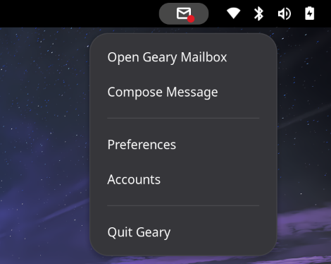

[](./README.ja.md)

# GNOME Shell Extension: Geary Indicator

Geary Indicator adds an icon to your tray to notify you of incoming mail in Geary. It also provides a popup menu with several actions.

## Features

- Adds an icon to the tray to check for incoming Geary mail
- Provides a popup menu with actions

## Screenshots

</img>

## Installation

### Install from GNOME Extensions Website
Coming soon

### Manual Installation

1. Clone or download the repository:
   ```bash
   git clone https://github.com/hallelujahdrive/geary-indicator.git
   ```
1. Move to the extension directory:
   ```bash
   cd geary-indicator
   ```
1. Build and install:
   ```bash
   make all
   make install
   ```
1. Restart GNOME Shell (press Alt + F2, type `r`, and press Enter).

## Usage

This extension is exclusively for use with [Geary](https://wiki.gnome.org/Apps/Geary).